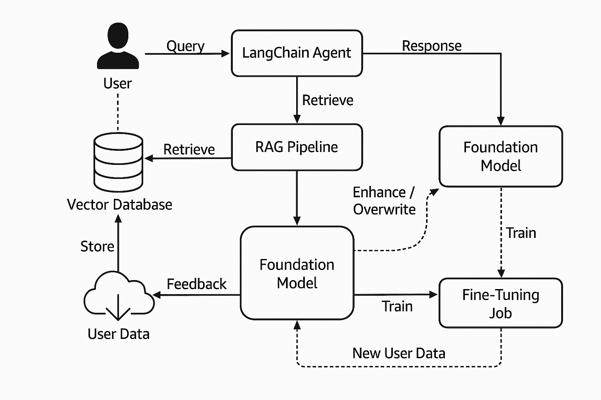

# RAG-FineTuning-Pipeline



A machine learning pipeline that integrates a LangChain Agent with a Retrieval-Augmented Generation (RAG) system and a Foundation Model, enabling query processing, data retrieval, and model fine-tuning based on user feedback and new data.

## Table of Contents

- [Overview](#overview)
- [Features](#features)
- [Architecture](#architecture)
- [Installation](#installation)
- [Usage](#usage)
- [Fine-Tuning](#fine-tuning)
- [Contributing](#contributing)
- [License](#license)

## Overview

This repository implements a pipeline for processing user queries using a LangChain Agent, retrieving relevant data via a RAG pipeline, and generating responses with a Foundation Model. The system supports continuous improvement through feedback loops and fine-tuning jobs, leveraging user data stored in a vector database.

The pipeline is designed for applications requiring natural language understanding, information retrieval, and adaptive learning, such as chatbots, question-answering systems, or personalized assistants.

## Features

- **LangChain Agent**: Handles user queries and orchestrates the pipeline.
- **RAG Pipeline**: Retrieves relevant information from a vector database to augment the Foundation Model's responses.
- **Foundation Model**: Generates responses based on retrieved data and user queries.
- **Fine-Tuning**: Updates the Foundation Model using new user data and feedback.
- **Vector Database**: Stores and retrieves user data for efficient query processing.
- **Feedback Loop**: Incorporates user feedback to enhance or overwrite model behavior.

## Architecture

The system follows a modular architecture, as shown in the diagram above:

1. **User**: Submits a query to the LangChain Agent.
2. **LangChain Agent**: Processes the query and interacts with the RAG Pipeline.
3. **RAG Pipeline**:
   - Retrieves relevant data from the Vector Database.
   - Passes the retrieved data to the Foundation Model.
4. **Foundation Model**:
   - Generates a response based on the query and retrieved data.
   - Can be enhanced or overwritten based on feedback.
5. **Vector Database**: Stores user data and provides retrieval capabilities for the RAG Pipeline.
6. **Fine-Tuning Job**:
   - Trains the Foundation Model using new user data.
   - Incorporates feedback to improve model performance.
7. **Feedback Loop**: User feedback is collected and used to enhance the model or overwrite its behavior.
8. **User Data**: New user data is stored in the Vector Database for future retrieval.

## Installation

### Prerequisites

- Python 3.8+
- [LangChain](https://github.com/langchain-ai/langchain) library
- A vector database (e.g., [FAISS](https://github.com/facebookresearch/faiss), [Pinecone](https://www.pinecone.io/), etc.)
- A foundation model (e.g., a pre-trained transformer model from [Hugging Face](https://huggingface.co/))
- Dependencies listed in `requirements.txt`

### Steps

1. Clone the repository:

   ```bash
   git clone https://github.com/yourusername/rag-finetuning-pipeline.git
   cd rag-finetuning-pipeline
   ```

2. Install dependencies:

   ```bash
   pip install -r requirements.txt
   ```

3. Set up the vector database:

   - Follow the documentation for your chosen vector database (e.g., FAISS, Pinecone) to set it up.
   - Populate the database with initial user data (see `data/` directory for sample scripts).

4. Download or configure the Foundation Model:

   - Download a pre-trained model from Hugging Face or another source.
   - Update the model path in `config.yaml`.

5. Configure the pipeline:
   - Edit `config.yaml` to specify paths to the vector database, model, and other settings.

## Usage

1. Start the LangChain Agent:

   ```bash
   python run_agent.py
   ```

2. Submit a query:

   - Use the provided API or CLI to send a query to the LangChain Agent.
   - Example:
     ```bash
     python query.py --query "What is the capital of France?"
     ```

3. Receive a response:

   - The agent will process the query, retrieve relevant data, and return a response generated by the Foundation Model.

4. Provide feedback:

   - Use the feedback API to submit feedback on the response.
   - Example:
     ```bash
     python feedback.py --response-id 123 --feedback "The response was accurate but could be more detailed."
     ```

5. Fine-tune the model:
   - Run the fine-tuning job to update the Foundation Model with new user data and feedback.
   - Example:
     ```bash
     python fine_tune.py
     ```

## Fine-Tuning

The fine-tuning process involves training the Foundation Model on new user data and feedback. To fine-tune the model:

1. Collect new user data and feedback.
2. Preprocess the data using the scripts in the `preprocessing/` directory.
3. Run the fine-tuning job:
   ```bash
   python fine_tune.py --data-path path/to/new_data --feedback-path path/to/feedback
   ```
4. The updated model will be saved to the specified output directory in `config.yaml`.

## Contributing

Contributions are welcome! Please follow these steps:

1. Fork the repository.
2. Create a new branch for your feature or bug fix:
   ```bash
   git checkout -b feature/your-feature-name
   ```
3. Commit your changes:
   ```bash
   git commit -m "Add your feature description"
   ```
4. Push to your branch:
   ```bash
   git push origin feature/your-feature-name
   ```
5. Open a pull request with a detailed description of your changes.

## License

This project is licensed under the MIT License. See the [LICENSE](LICENSE) file for details.
