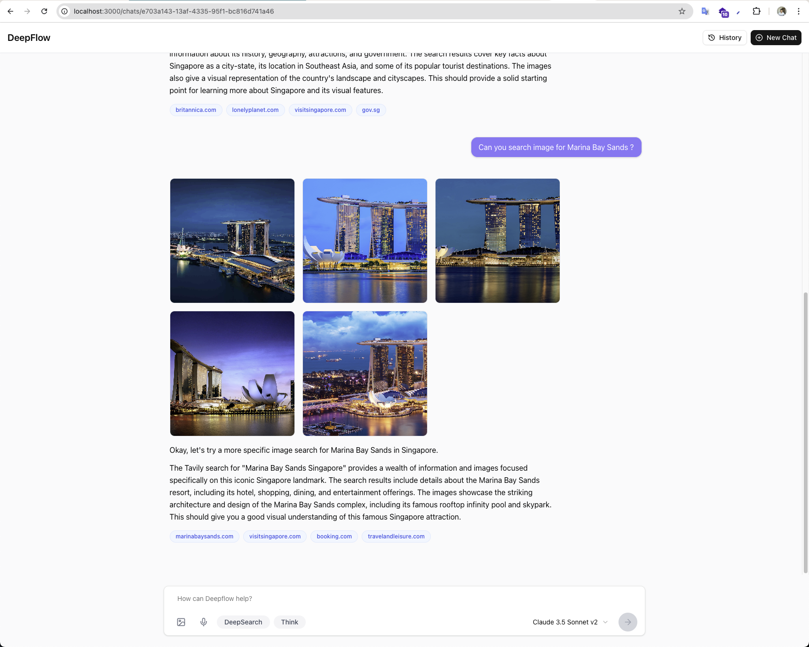

# Deepflow

An advanced Agentic AI system built on LangGraph and RAG, seamlessly integrating specialized tools and
AWS services—such as Lambda, S3, Bedrock, SageMaker, and Aurora RDS—to synergize large language models with
capabilities like web search, GitHub repository importing, and automated task execution



## Setup Instructions

### Prerequisites

- AWS CLI installed and configured
- Terraform installed
- Docker installed (for building and pushing container images)
- Bun.js for running the web application

### Step 1: Configure AWS CLI

```bash
aws configure
```

Enter your AWS Access Key ID, Secret Access Key, default region (ap-southeast-2), and output format (json).

### Step 2: Setup ECR Repositories

```bash
# View available make commands
make help

# Create ECR repositories
make setup-ecr

# If you need to delete ECR repositories
make drop-ecr
```

### Step 3: Setup Terraform Remote State

```bash
# Navigate to the state directory
cd deploy/state

# Comment out the terraform backend block in main.tf
# (lines 45-52 in main.tf)

# Initialize and apply terraform to create S3 bucket and DynamoDB table for state
terraform init
terraform apply

# After successful creation, uncomment the backend block and re-initialize
# to migrate state to S3
terraform init
```

### Step 4: Deploy Infrastructure

```bash
# Navigate to the infrastructure directory
cd deploy/infra/env/prod

# Create or update terraform.tfvars using the following format:
aws_region = "ap-southeast-2"
vpc_name = "LLMToolFlow_vpc"
cidr_block = "10.0.0.0/16"
aurora_name = "llmtoolflow-aurora"
aurora_master_username = "root"
elasticache_enabled = false
elasticache_name = "llmtoolflow-elasticache-redis"
secret_name = "llmtoolflow-envs"
bastion_name = "LLMToolFlow"
ec2_bastion_ingress_ips = ["your-ip-address/32"]
kb_name = "LLMToolFlow_kb"
kb_s3_bucket_name_prefix = "llmtoolflow-kb"
kb_oss_collection_name = "llmtoolflow-kb"
kb_model_id = "amazon.titan-embed-text-v2:0"
s3_bucket_handler_name = "llmtoolflow-handler-files"
lambda_function_handler_name = "llmtoolflow-handler"
lambda_function_ecr_image_uri = "your-account-id.dkr.ecr.ap-southeast-2.amazonaws.com/llmtoolflow-prod-handler-ecr:0.0.6"
sagemaker_enabled = false
sagemaker_name = "llmtoolflow-sagemaker"
sagemaker_ecr_image_uri = "763104351884.dkr.ecr.ap-southeast-2.amazonaws.com/huggingface-pytorch-tgi-inference:2.6.0-tgi3.2.3-gpu-py311-cu124-ubuntu22.04-v2.0"
sagemaker_initial_instance_count = 1
sagemaker_instance_type = "ml.g5.xlarge"
sagemaker_hf_model_id = "meta-llama/Meta-Llama-3.1-8B-Instruct"
sagemaker_hf_access_token = "your-huggingface-token"
sagemaker_tgi_config = {
  max_input_tokens = 4000,
  max_total_tokens = 4096,
  max_batch_total_tokens = 6144,
}

# Deploy shared modules first
terraform init
terraform plan -out=tfplan -target="module.shared"
terraform apply tfplan

# Configure environment variables in AWS Secrets Manager
# Go to AWS Console > Secrets Manager > Find "llmtoolflow-envs" secret
# Update with necessary environment variables

# Deploy handler module
terraform plan -out=tfplan -target="module.handler"
terraform apply tfplan
```

### Step 5: Configure and Run Web Application

```bash
# Copy the API Gateway URL from AWS Lambda Console
# Navigate to the app directory
cd app

# Create .env file with API Gateway URL
echo "API_URL=https://your-api-gateway-url" > .env

# Install dependencies and run the app
bun install
bun run dev
```

### Full Deployment (Building and Deploying Handler)

To build, push, and update the handler Lambda function:

```bash
# Build and push the handler container
make all SERVICE=handler MAJOR=0 MINOR=0

# This will:
# 1. Create a virtual environment and install dependencies
# 2. Run tests (if any)
# 3. Build the container image
# 4. Push to ECR
# 5. Update terraform.tfvars with the new image URI
```

After pushing a new image, update the Lambda function:

```bash
cd deploy/infra/env/prod
terraform plan -out=tfplan -target="module.handler"
terraform apply tfplan
```

## Architecture

The system uses several AWS services:

- API Gateway and Lambda for backend processing
- S3 for file storage
- Amazon Bedrock or SageMaker for LLM inference
- AWS Knowledge Base for document storage and retrieval
- Aurora PostgreSQL for database storage (optional)
- ElastiCache for Redis caching (optional)

## Web Application

The web application is built with Next.js and provides a simple interface for interacting with the tool flow system.
